# 22-2-PP
## 2022년 2학기 실전프로젝트 공부 입니다.
--------
[프로젝트 진행보고서](Project1/ProgressReport.md)

### 1.설치된 IDE

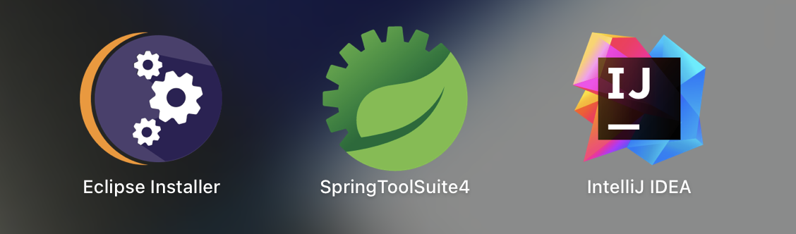

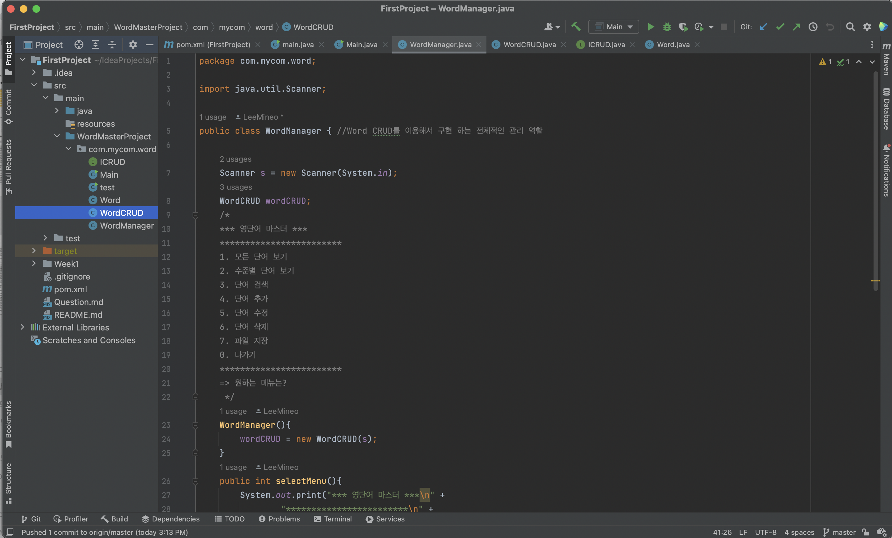

-------------

### 2.실행화면

2-1. [4.단어 추가]  
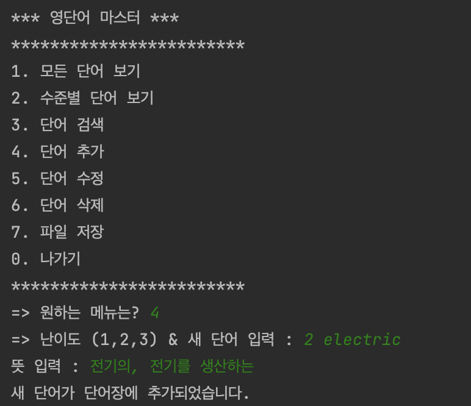
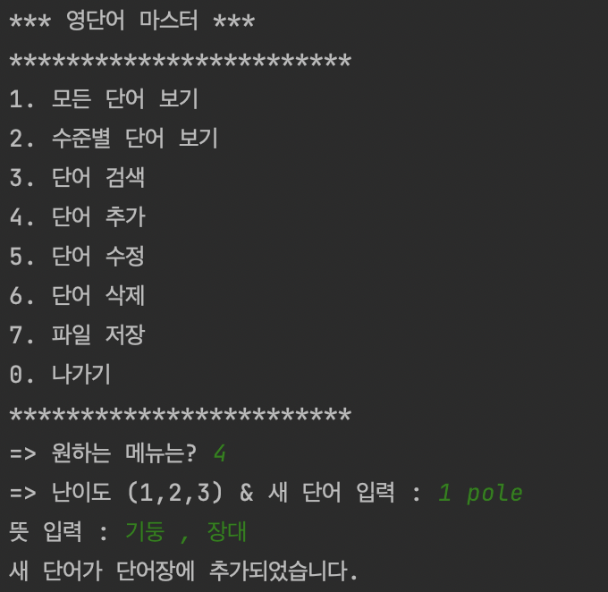

2-2. [1.모든 단어보기]  
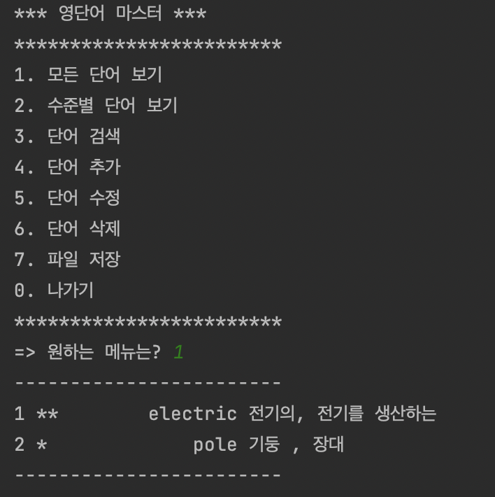

2-3. [0.나가기]   
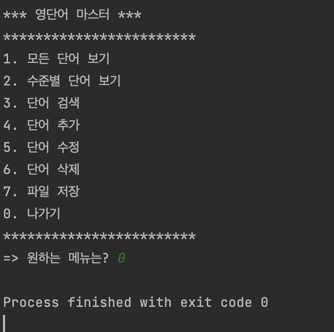

-------------------

### 3.추가된 기능 실행화면

3-1.[2.수준별 단어보기]  
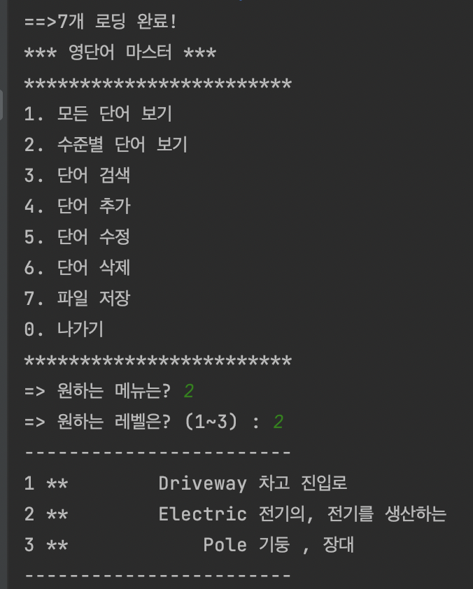  

3-2.[3.단어 검색]  
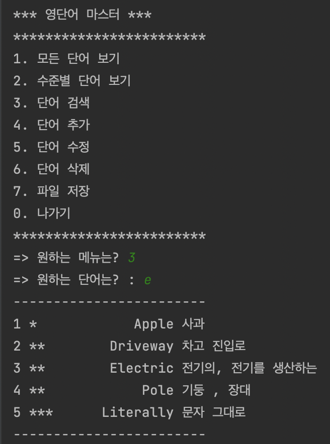  

3-3.[5.단어 수정]  
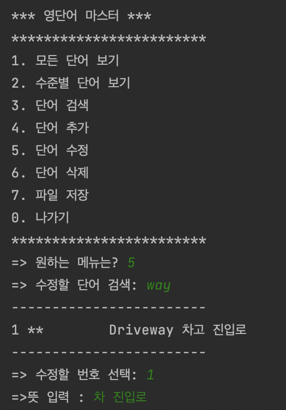
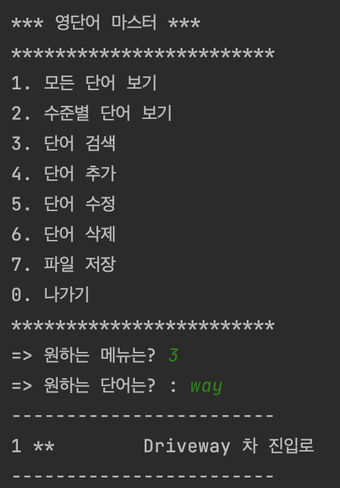  

3-4.[6.단어 삭제]  
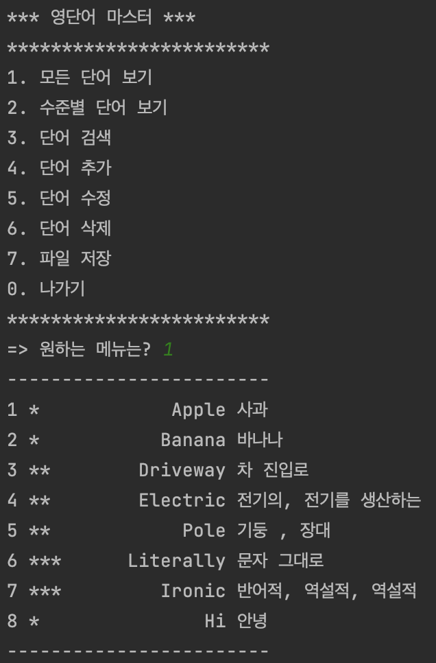
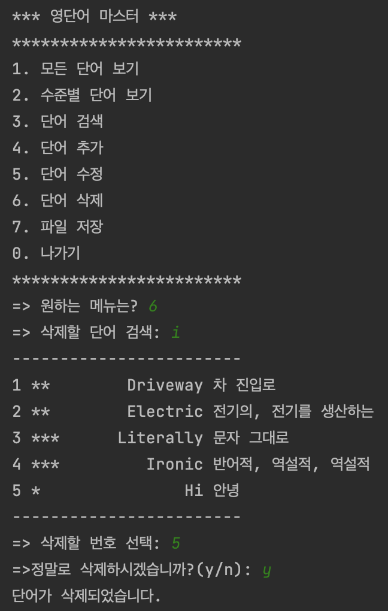 
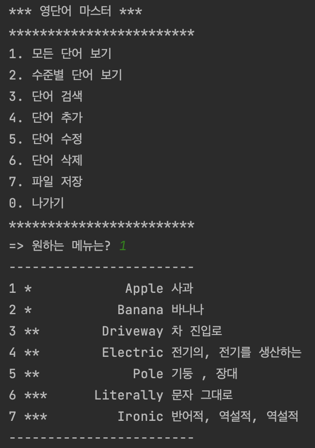  

3-5.[7.파일 저장]  
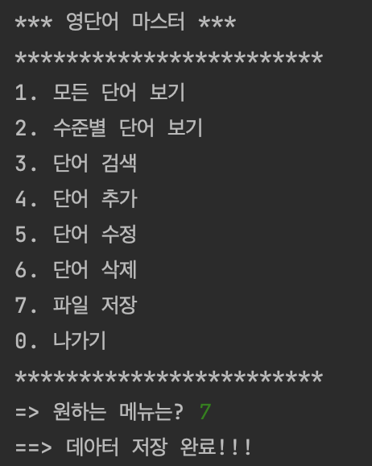 
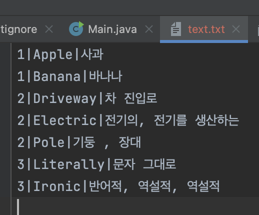 
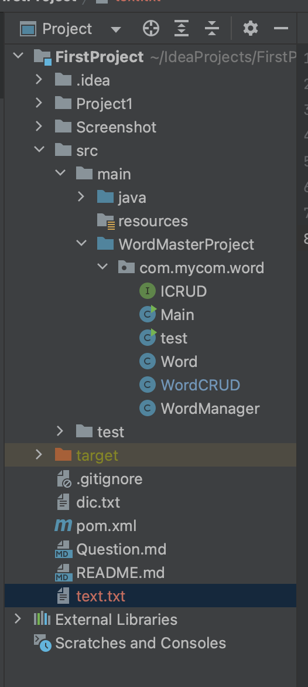  

3-6.[1.모든 단어보기]를 실행시 단어 출력 
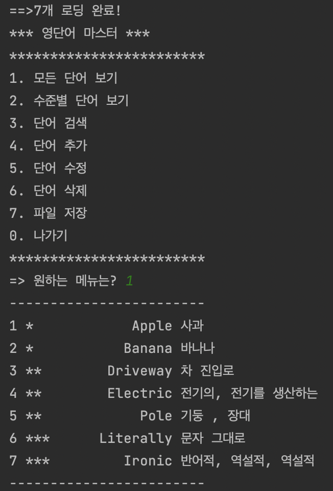  
